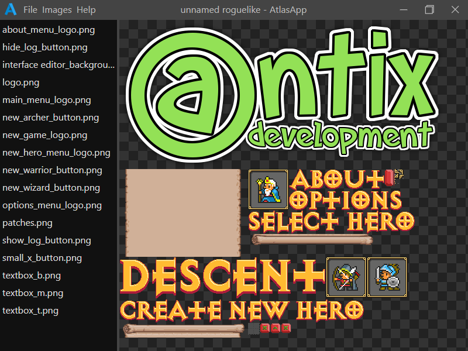

<!--
AtlasApp - A basic texture packing application.
Copyright (c) Cliff Earl, Antix Development, 2022.
MIT License:
-->

# AtlasApp

### About

AtlasApp is a basic texture packing application.

Texture packs (or srite sheets as they are also known) are most often used in 2D games, and are used for both convienience and performance.

A texture pack consists of two files:

1. An image that contains an arbitrary number of sub images.

2. A text file containing information on each sub-image contained in the image.

There are many other applications available to pack textures and most of them are in all likelyhood better than AtlasApp, and in fact AtlasApp has some limitations:

- Image padding of 1 pixel supported only. No other padding options are available.
- No extrusion option.
- No folder or "grouping" of sub-images.
- Only one algorithm for packing sub-images.

AtlasApp exists because I require a texture packing application for a project I am currently working on. It is also a test of [Electro](https://github.com/Antix-Development/electro), my Electron template.

If you find AtlasApp useful maybe you will start my repository and maybe you would also consider [buying me a coffee](https://www.buymeacoffee.com/antixdevelu) :)

---

### Instructions

I'm not going to bore you with a blow by blow account on how to use AtlasApp since you should probably be kind of aware of what it it does and will make do by fumbling your way around it's interface.

Instead I'll just say that the output is in the form of an image file, and a text file, where the text file where each line contains CSV data in the following format:

`filename, x, y, width, height`
